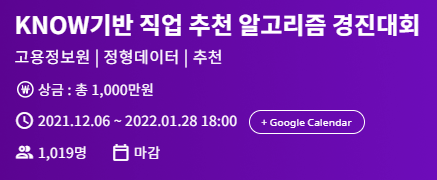
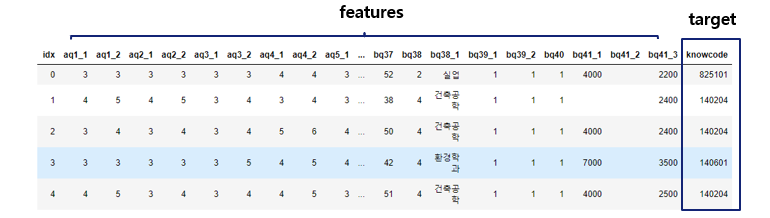
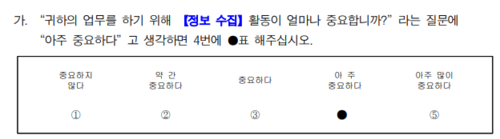
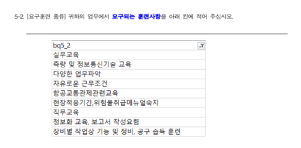
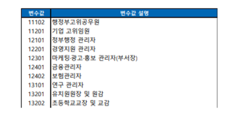

# 🔍Introduction

#### 목적
- KNOW(한국직업정보) 설문 데이터셋을 활용한 직업 추천 알고리즘 개발
- 직업과 연관이 높은 설문지 문항 분석 및 영향변수 발굴
#### 주최 / 주관
- 주최 : 한국고용정보원  /  주관 : 데이콘

#### 리더보드
- Eval Metric : Macro F1-score
- Public Score : 전체 테스트 데이터 중 33% / Private Score : 전체 테스트 데이터 중 67%

#### 최종 순위
### 🎖 3rd Prize

 

# 🗂Data Set

- 전체 데이터셋 row 약 4만개, column 갯수 약 160개

### Features
- Likert 5, 7점 척도 기반의 설문

- 주관식 질문

### Target 
- 약 600개의 직업코드 

 

# 🧑‍💻Model

### Tabular Data
설문조사 데이터는 Categorical Data가 많은 정형데이터이기때문에

정형데이터 처리에 효과적인 Gradient Boosting 기반의 모델 중 CatBoost를 사용

### Text Data
직업의 특성이 드러나는 주관식 답변들을 한 문장으로 만든 후 KoNLPy의 Mecab 형태소 토크나이저를 이용

짧은 길이의 Keyword 중심 답변들이 많아 LSTM보다 1D-CNN 모델이 더 높은 성능을 보임

### HyperParameter Tuning
#### CatBoost
- loss_function을 MultiClass(1:1:1..1 예측)에서 MultiClassOneVsAll(1:다 예측)로 바꿔

    train에 걸리는 시간을 1/7정도로 줄이고 F1-Score도 높임
    
### Ensemble
CatBoost와 1D-CNN이 출력한 모든 클래스에 대한 확률값에 
Min-Max Scaler를 적용시킨 후 Soft-Voting

 

# 데이터 활용
### 취하자 - 직업 추천 웹사이트
https://github.com/PancakeCookie/Job-Recommendation-Website

### 뉴스 기사 분석
일자리 증가, 감소, 유지

